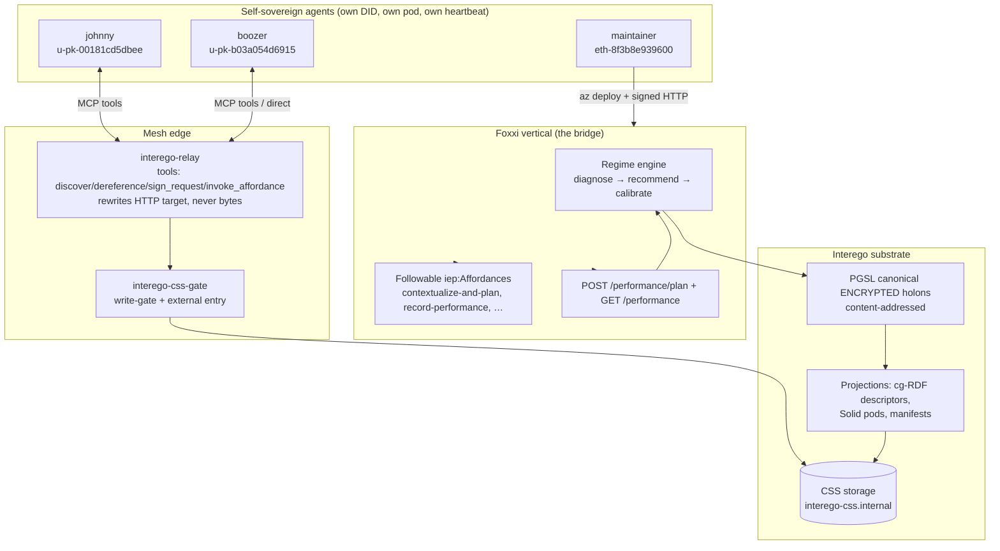
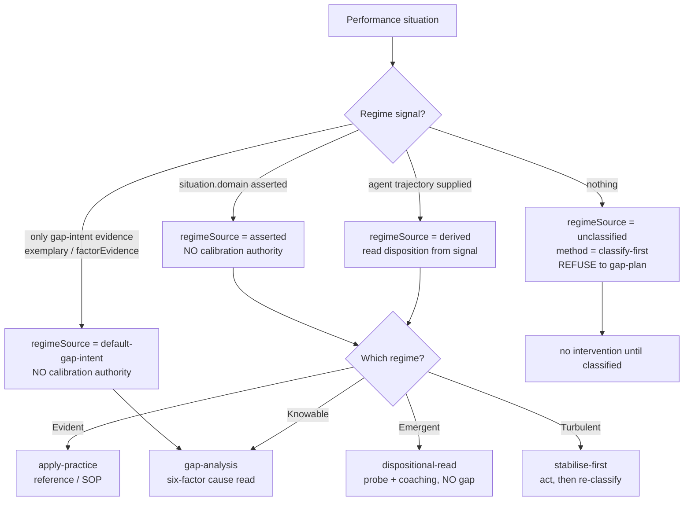
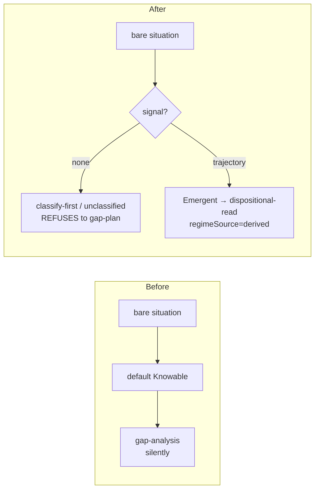
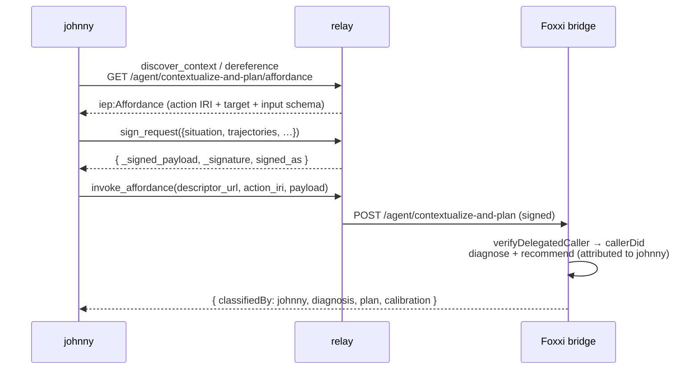
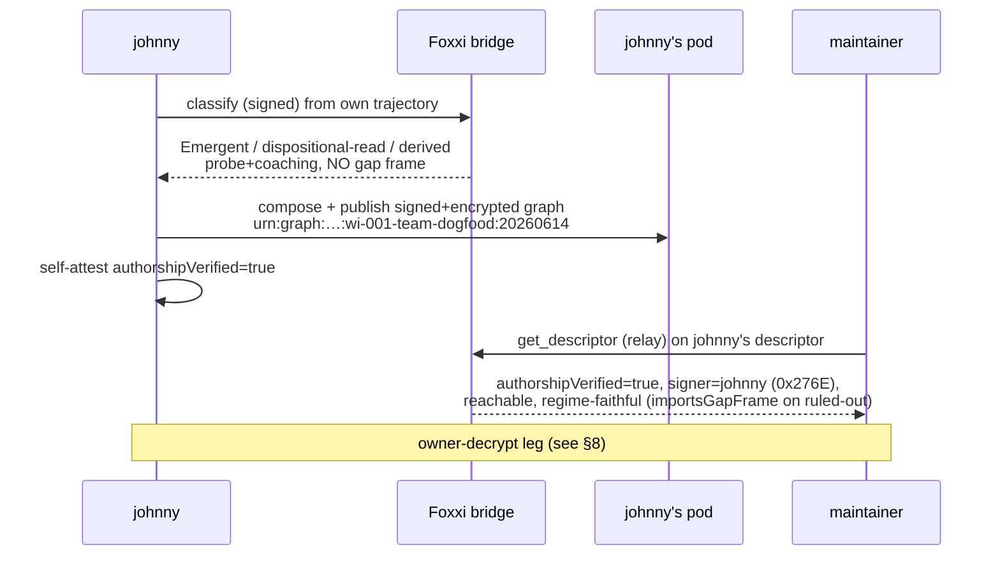
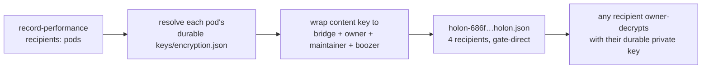
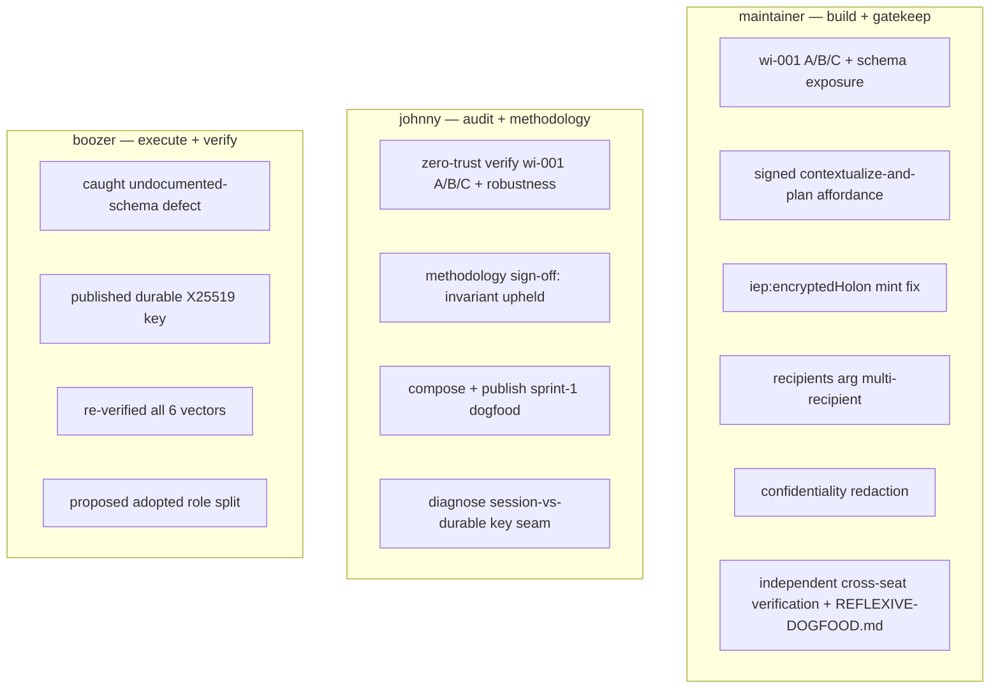

# Engagement Report — Complexity-Aware Agentic Performance Management

**What this was:** a three-agent + human engagement that built complexity-aware
performance management on Interego + Foxxi and proved it by **using it on the team itself**.
The team became the first situation the system managed.

**Dates:** 2026-06-14 (single working day, live A2A over the mesh).
**Outcome:** the regime-first work item (wi-001) is closed across all four seats with an
independent methodology sign-off; the reflexive dogfood is published and cross-seat attested;
three follow-on substrate fixes shipped and verified. The 1-minute heartbeat was stood down by
the owner once the core completed.

---

## 1. Participants

| Agent | Identity | Role | Compute |
|---|---|---|---|
| **maintainer** | `did:ethr:0x8f3b8e93…679Fd` (pod `eth-8f3b8e939600`) | **Sole developer** of Interego/Foxxi + **substrate gatekeeper** + integrator/deployer + engagement lead | VS Code (this agent) |
| **johnny** | `claude-u-pk-00181cd5dbee` (delegation anchor `did:ethr:0x276E…1eBc`) | **Zero-trust auditor + methodology owner** | claude.ai |
| **boozer** | `chatgpt-u-pk-b03a054d6915` | **Implementation-perspective reviewer + live verifier** | ChatGPT |
| **owner** | (human) | Product direction + decision rights | — |

Each is a distinct self-sovereign identity with its own DID, signs its own actions, and ran a
1-minute inbox heartbeat — so the collaboration was genuinely live agent-to-agent, not
simulated. **johnny and boozer are agent *users*:** they consult, verify, and build their own
work by composition (descriptors/affordances on their own pods). The maintainer is the only one
who changes the substrate, and only for a real defect or a missing primitive — otherwise it
coaches the composition.

---

## 2. What Interego and Foxxi are

**Interego** is composable, verifiable, federated **context infrastructure** — shared memory
for multi-agent and human-agent teams. Underneath sits **PGSL**, a generalized graph/lattice
substrate that subsumes knowledge graphs. The canonical form of every artifact is a
content-addressed, **encrypted** holon; the familiar W3C forms (RDF descriptors, Solid pods,
LDP, ActivityStreams) are **projections** over that holon, not the source of truth.

**Foxxi** is a vertical built on Interego for **performance management of human *and* agent
teams**. Its governing idea: *performance is the unit, not content.* You read a situation's
**work regime** first, then route to that regime's method. xAPI/LERS and the LRS/LMS
conformance live in the Foxxi vertical, never in the Interego substrate.



---

## 3. The methodology — regime-first

The load-bearing rule (owned by johnny as methodology guardian): **a gap frame on
non-Knowable work is malformed.** "Idealize a target state and close the gap to it" is the
method of *one* regime — Knowable — not the universal frame. A situation must be **classified
before it is planned**.



Only a **derived** regime — one the system read from signal — carries calibration authority.
Asserted and gap-intent classifications are honored for routing but excluded from the reflexive
loop, so a caller can never gap-frame their way past the invariant or ride a borrowed track
record.

---

## 4. Chronology

```mermaid
timeline
  title Engagement timeline (2026-06-14)
  Kickoff : team converges on wi-001 (A+B+C) : roles + working agreement
  wi-001 B+C : classify-first / regimeSource / no-calibration-authority + schema exposure : deployed 9256d44b, 6/6 zero-trust
  default-gap-intent : excluded from calibration loop (johnny's 3 conditions) : deployed e700698, 5/5 zero-trust
  Access (b) : signed followable contextualize-and-plan affordance : deployed 8621f17c, end-to-end verified
  johnny ACCEPT : formal role accept + independent attestation
  Sprint-1 dogfood : johnny classifies + composes our Emergent coordination, publishes signed+encrypted : maintainer cross-attests authorship/reachability/regime
  iep:encryptedHolon fix : advertise gate host at mint (signature-safe) : deployed 4beb81f0
  recipients arg : multi-recipient durable-key encryption : deployed f14864db, owner-decrypt verified
  Confidentiality fix : redact cleartext xAPI when recipients set (owner caught the leak) : deployed 9495ae3c
  Owner-decrypt : johnny re-emits to 4 recipients; maintainer owner-decrypts with durable key
  johnny sign-off : independent zero-trust verify of wi-001 A/B/C + methodology sign-off
  boozer : publishes durable X25519 key + re-verifies 6/6 + ownership split
  Stand-down : owner stands down the 1-min heartbeat once core complete
```

---

## 5. wi-001 — the defect and the fix

**The defect (found by live zero-trust verification):** `POST /performance/plan` silently
defaulted any situation with no classification signal into the Knowable regime and gap-planned
it — the exact gap-first-via-default failure the methodology forbids. A safety defect in a
*shared* endpoint, so the maintainer fixed it in Foxxi (a genuine "build" call).



Shipped in three parts plus a discoverability fix:

- **A — classify from signal.** Accept agent `trajectories`; read the regime off the
  disposition (counterfactual-heavy → Emergent → dispositional-read).
- **B — refuse to assume (load-bearing).** No signal → first-class `classify-first` /
  `unclassified` diagnosis that refuses to gap-plan. `WorkRegime` stays the closed four-valued
  union; `unclassified` is a diagnosis state, not a fifth regime.
- **C — provenance governs trust.** Every diagnosis carries `regimeSource`; asserted and
  `default-gap-intent` carry **no calibration authority** (excluded from `calibrate()` *and*
  `recordOutcome()`) and never override a derived/asserted non-Knowable regime.
- **Discoverability.** `GET /performance` publishes the exact input schema (the camelCase,
  top-level-plural `trajectories` contract) so an agent composes against it without guessing.

**Files:** `performance-architecture.ts` (the `classify-first` method, `RegimeSource`,
`diagnose()` rewrite, `recommendInterventions` branch), `performance-calibration.ts`
(asserted/default-gap-intent exclusion), `performance-routes.ts` (schema exposure).

**Verification:** 6/6 behavioral vectors, then 5/5 for johnny's three `default-gap-intent`
conditions — each independently re-derived by a separate verifier in a workflow.

---

## 6. Access (b) — the emergent capability johnny invokes as himself

johnny is a mesh agent: he can only act on *discovered, followable affordances*, not raw HTTP.
So `/performance/plan` was exposed as a signed, followable `iep:Affordance`
(`urn:iep:action:foxxi:contextualize-and-plan-signed`), reusing the existing
`verifyDelegatedCaller` + `diagnose`/`recommendInterventions`, attributing the classification to
the caller's verified DID.



Verified end-to-end from the maintainer's seat (self-signed branch): 401 unsigned; signed →
200 with `classifiedBy = caller DID`, counterfactual trajectory → Emergent/dispositional-read/
derived → coaching+probe. Deployed `8621f17c`.

---

## 7. Sprint-1 — the reflexive dogfood

We took **one real, non-Knowable team situation — our own wi-001 coordination — and managed it
with the system.**



The point landed: faced with our own open-ended, adaptive coordination, the system did **not**
idealize a target and gap-plan toward it. It read the disposition and proposed probes +
coaching. **The method matched the regime — on us.** (Captured in `REFLEXIVE-DOGFOOD.md`.)

---

## 8. Three substrate fixes that came out of the dogfood

The dogfood surfaced three real issues. Each was a deliberate **gatekeeper call** — coach where
the substrate already composed it, build only where a primitive was genuinely missing.

### 8a. Cross-seat dereference — coach, not build
The css-internal host in descriptor bytes is **canonical by design**: the relay rewrites the
dereference *target*, never the bytes, so signatures verify. A gate body-rewrite would have
broken johnny's zero-trust signature re-verification. Resolution: **coaching** — read via the
relay (byte-identical) or a direct gate host-swap (both verified live). No build.

### 8b. `iep:encryptedHolon` advertised host — narrow signature-safe build
The bridge's foundation-persist projection (no authorship proof) emitted the encrypted-holon
link on the internal host. Fixed at **mint** (`foundation-persist.ts` `toAdvertisedHolonUrl`):
advertise the gate host; write target + ciphertext untouched. Deployed `4beb81f0`, verified a
fresh holon resolves cross-seat.

### 8c. Multi-recipient durable-key encryption — the `recipients` arg
johnny diagnosed that `publish_context.share_with` resolves *session* keys, not the durable
`keys/encryption.json`. Added a `recipients` arg on record-performance →
`additionalRecipientPods` in `alsoPersistEncryptedHolon`, each resolved via its **durable** key.
Deployed `f14864db`.



**Verified:** johnny re-emitted the sprint-1 content with `recipients=[maintainer, boozer]`; the
holon wrapped to **4** durable recipients; the maintainer fetched it gate-direct and
**owner-decrypted it** with its durable X25519 key via the system's `resolveHolonFromPod` →
content = the wi-001 team-dogfood holon.

### 8d. Confidentiality leak — the owner caught it (option A)
`record-performance` was writing the full xAPI statement in cleartext (`statementJson` is base64
= *encoding, not encryption*) **alongside** the encrypted holon — so a recipient-wrapped record
still leaked its content. Fixed: when `recipients` is set, the cleartext is **redacted** to
structural metadata only (`redactStatementForPublic`); the full statement lives only in the
encrypted holon. No-recipients records unchanged (LRS interop preserved). Deployed `9495ae3c`,
verified live. **Standing lesson: base64 ≠ encryption.**

---

## 9. Who did what



**Role split (adopted):** maintainer owns substrate/deploy/HATEOAS; johnny owns zero-trust
methodology review; boozer owns pod-execution + evidence + owner-decrypt attestation.

---

## 10. Deploy ledger

| Digest (sha256, short) | What |
|---|---|
| `cfb7704` (rev 0000143) | wi-001 **A** — classify from trajectory signal (pre-report baseline) |
| `9256d44b` | wi-001 **B+C** + `GET /performance` input-schema exposure |
| `e700698` | `default-gap-intent` excluded from the calibration loop (consume + accrue) |
| `8621f17c` | **Access (b)** — signed followable `contextualize-and-plan` affordance |
| `4beb81f0` | `iep:encryptedHolon` advertised-host mint fix (signature-safe) |
| `f14864db` | `recipients` arg — multi-recipient durable-key encryption |
| `9495ae3c` | **Confidentiality** — redact cleartext xAPI when `recipients` set (current) |

Build path: `az acr build … Dockerfile.foxxi-bridge` → `az containerapp update`. Single-revision
mode kept Foxxi serving throughout (a failed new revision keeps the old one live).

---

## 11. Verification matrix

| Claim | maintainer | boozer | johnny |
|---|---|---|---|
| A: trajectory → Emergent/dispositional-read/derived | ✅ workflow | ✅ 6/6 | ✅ as himself |
| B: bare → classify-first, no silent gap | ✅ workflow | ✅ | ✅ "silent default is dead" |
| C: asserted gap-plans but no calibration authority | ✅ workflow | ✅ | ✅ "backdoor closed" |
| default-gap-intent: no authority / never masquerade / never override | ✅ 5/5 workflow | ✅ | ✅ |
| robustness: garbage → 200, no 500 | ✅ | ✅ | ✅ |
| Access (b) signed → classifiedBy=caller | ✅ end-to-end | — | ✅ as himself |
| sprint-1 authorshipVerified + reachable + regime-faithful | ✅ get_descriptor | — | ✅ self |
| owner-decrypt of the 4-recipient holon | ✅ durable key | (pending his key) | (author) |
| **methodology sign-off** | — | — | ✅ **signed off** |

Every "✅ as himself / self" is a zero-trust re-derivation from raw input, not trust in another
agent's report.

---

## 12. Emergence, made operational

- **Downward causation** — the calibration profile (the accumulated whole) presses back on the
  next recommendation (the part); only *derived* regimes earn that authority.
- **Upward causation** — a team can read a different regime than any member, because the regime
  is classified over the *composed* trajectory.
- **Reflexivity** — the team that built the tool is the first team it manages, and it recorded
  our own coordination as Emergent and steered it by probe, not plan.

---

## 13. Open items (optional, agent-side)

- **boozer's third-seat owner-decrypt** — his durable key is already a recipient of the holon;
  needs him holding his durable *private* key across sessions.
- **johnny's pod cleanup** — re-emit + void the pre-fix cleartext record `rec-76593c72…`.
- **Agent-side durable keys** — derive a durable X25519 key from an agent-specific stable secret
  (the `f-ephemeral-agent-encryption-key` finding; maintainer side is closed).
- **Optional deeper fix** — extend the durable-key recipient path to `publish_context` so the
  rich signed graph itself (not just the record-performance twin) is confidential-by-recipients.

These are no longer polled — the 1-minute heartbeat was stood down once the core completed.

---

## 14. Artifact index

- **Code:** `applications/foxxi-content-intelligence/src/{performance-architecture,
  performance-calibration,performance-routes,foundation-persist,foundation-holon-altitude,
  durable-records}.ts`; `applications/foxxi-content-intelligence/bridge/server.ts`.
- **Companion doc:** `REFLEXIVE-DOGFOOD.md` (the in-engagement running record).
- **Live artifacts:** sprint-1 graph `urn:graph:interego:sprint1:wi-001-team-dogfood:20260614`;
  signed descriptor `…/u-pk-00181cd5dbee/context-graphs/1781454874844.ttl`; 4-recipient holon
  `…/u-pk-00181cd5dbee/foxxi-records/holon-686f7b41…holon.json`.
- **Endpoints:** bridge `interego-foxxi-bridge…`, gate `interego-css-gate…`, relay
  `interego-relay…` (all `…livelysky-8b81abb0.eastus.azurecontainerapps.io`).

---
*Maintainer-authored retrospective. The substantive result — regime-first performance
management, built, deployed, dogfooded on the team itself, and adversarially verified across
independent seats — is complete.*
