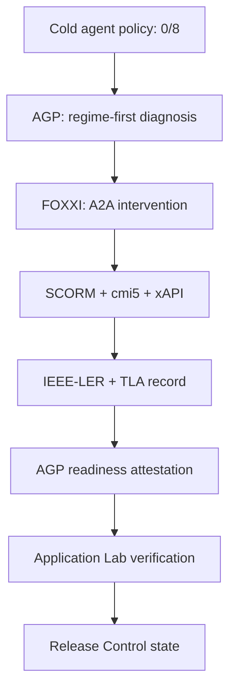

# FOXXI × AGP × Release Control — cold-start proof

This executable example demonstrates three independent applications that compose
through signed evidence rather than private API coupling:



The agent begins with a content-addressed `first-open` Tic-Tac-Toe policy that
fails eight held-out tactical cases. AGP places this as **Knowable** work,
isolates a real knowledge/skill deficiency, and selects instruction only because
the task is frequent and must be performed from memory. FOXXI composes an A2A
course from content-addressed fragments and emits an actual SCORM 2004 ZIP,
cmi5 course structure, conformant xAPI statements, an IEEE P2997-style Enterprise
Learner Record, and an ADL-TLA proficiency roll-up.

The improved policy is a deterministic table over every reachable X-turn board.
It passes all held-out cases. AGP then derives—not accepts from the caller—a
typed readiness decision binding the exact candidate SHA-256, suite SHA-256,
diagnosis, evaluations, xAPI statement IDs, and portable record.

Finally, a generic Application Lab contract declares that evidence dependency.
It pins the candidate, held-out suite, decision rule, signer, document type, and
graph. The runtime verifies the descriptor, current graph head, CID, canonical
JSON digest, guard, effects, CAS link, and full replay. Release Control knows
nothing about FOXXI or AGP APIs. Its `deploy` action only advances signed
application state; it has **zero infrastructure effects**.

Run the proof:

```bash
node --import tsx examples/foxxi-agp-release-showcase/run.ts
```

Run the adversarial verification:

```bash
npx vitest run integrations/tests/foxxi-agp-release-showcase.test.ts \
  applications/agentic-performance-practice/tests/readiness-evidence.test.ts
node --import tsx deploy/mcp-relay/_application-lab-test.ts
```

This proof prepares unsigned graphs locally. Publishing/signing is intentionally a
separate authenticated Interego action; the demo contains no private key and does
not bootstrap, republish, activate, or deploy infrastructure.
